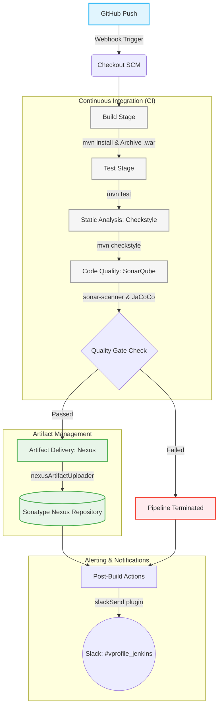

# VProfile CI/CD Pipeline

## Overview

This repository hosts the Jenkins Declarative Pipeline orchestration for the **VProfile** enterprise web application. The pipeline provides a fully automated Continuous Integration and Continuous Deployment (CI/CD) workflow, ensuring rigorous code quality checks, automated testing, and secure artifact management.

## 🏗️ Pipeline Architecture

The pipeline follows a robust, multi-stage architecture designed to fail fast and provide immediate feedback to developers.

## 🚀 Pipeline Stages Breakdown

The pipeline is structured into the following sequential stages:

1. **Checkout SCM**: Fetches the latest source code from the configured Git repository, resolving the target branch dynamically.
2. **Build**: Executes Maven (`mvn install`) to compile the source code, resolve dependencies, and package the application into a `.war` artifact. Tests are temporarily bypassed (`-DskipTests`) during this phase to accelerate the compilation feedback loop. The resulting artifact is securely archived within the Jenkins workspace.
3. **Test**: Executes the automated unit testing suite utilizing Maven (`mvn test`). Ensures foundational code integrity before proceeding to static analysis.
4. **Checkstyle Analysis**: Enforces coding standards and best practices through Maven Checkstyle integration (`mvn checkstyle:checkstyle`).
5. **Sonar Analysis**: Performs comprehensive static code analysis utilizing the SonarQube Scanner. This stage detects bugs, vulnerabilities, code smells, and correlates JaCoCo code coverage metrics.
6. **Quality Gate**: A critical verification checkpoint. The pipeline awaits a response from the SonarQube server (with a configured timeout of 1 hour) to confirm if the code adheres to organizational quality thresholds. Non-compliant builds are immediately aborted.
7. **Nexus Upload**: Upon a successful Quality Gate evaluation, the verified `.war` artifact is securely published to the Sonatype Nexus Repository Manager (`vprofile-release` repository).
8. **Slack Notifications**: Dispatches real-time status alerts (Success/Failure) to the designated Slack channel (`#vprofile_jenkins`). Alerts contain actionable metadata, including the build number and a direct hyperlink to the Jenkins job console.

## 🛠️ Technology Stack

The infrastructure leverages the following industry-standard toolchain:

| Component | Technology | Version / Details |
| :--- | :--- | :--- |
| **CI/CD Orchestration** | Jenkins | Declarative Pipeline |
| **Build Automation** | Apache Maven | `3.9.12` |
| **Runtime Environment** | Java JDK | `21` |
| **Code Quality Engine** | SonarQube | Continuous Inspection |
| **Artifact Repository** | Sonatype Nexus | `Nexus3` |
| **Static Code Analysis** | Checkstyle | Integrated via Maven |
| **Alerting** | Slack | Jenkins Slack Plugin |

## ⚙️ Environment Variables & Configuration Matrix

The pipeline execution is driven by environment variables explicitly defined within the `Jenkinsfile` environment block.

### Global Variables

* `SNAP_REPO`: `vprofile-snapshot`
* `RELEASE_REPO`: `vprofile-release`
* `CENTRAL_REPO`: `vpro-maven-central`
* `NEXUSIP`: `172.31.14.229`
* `NEXUSPORT`: `8081`
* `NEXUS_GRP_REPO`: `vpro-maven-group`
* `SONARSERVER`: `SonarQube-server` (Jenkins global configuration name)
* `SONARSCANNER`: `SonarQube Scanner` (Jenkins global tool name)

### Required Credentials Binding

The Jenkins environment must have the following credentials provisioned:

* `nexus-login` (Username/Password): Authentication context for the Sonatype Nexus Repository Manager.
* `slacke-cicd` (Secret text): Slack integration token (abstracted via the Slack Jenkins plugin).

## 📝 Change Log

### Recent Maintenance Updates
* **Configuration Integrity**: Remediated tool declarations within the pipeline execution context. Explicitly bound the `maven` and `jdk` directives to provision `maven:3.9.12` and `JDK21` correctly across pipeline agents.

---
*Maintained by the DevOps Engineering Team. Auto-generated documentation aligned with current CI/CD infrastructure state.*
